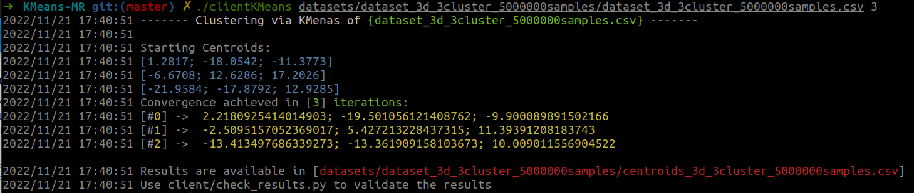
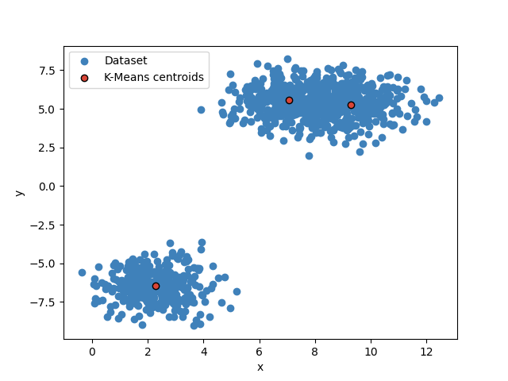

# K-Means Custering via MapReduce Implementation 

Author: [Michele Salvatori](https://github.com/michsalvv)

--- 
## Specification

Realizzazione di un servizio distribuito che implementa l'algoritmo di *clusterizzazione* **Kmeans** utilizzando il paradigma di computazione **MapReduce**. 
L'algoritmo è stato implementato utilizzando una delle euristiche più note e più semplici, quella di *Lloyd*, che trova in modo iterativo il centroide di ciascun cluster in cui è partizionato l'insieme di punti e quindi riassegna i punti ai cluster in base al centroide più vicino. 
In questa repository è inoltre possibile consultare:
* Report in formato `.pdf`: link
* Analisi delle performance: link

## Deployment
Il deployment del servizio è stato effettuato utilizzando i servizi web *Amazon Web Services (AWS)*. In particolare è stata utilizzata un'istanza del servizio *EC2* sulla quale viene eseguito un cluster di Docker Container composto da $M$ nodi *Mapper*, $N$ nodi *Reducer* ed un singolo nodo *Master* che gestirà l'intera esecuzione dell'algoritmo. 

Per riprodurre tale scenario è sufficiente:
1. Creare un'istanza *EC2*
2. [optional] Assegnargli un IP Statico creatndo un *ElasticIP* offerto sempre dal servizio *EC2* 
3. Clonare in una macchina locale questa repository
4. Eseguire lo script *Ansible* che procederà ad installare le componenti *Docker* e *Docker Compose* sull'istanza virtuale e ad eseguire l'upload delle librerie che implementano il servizio KMeans.

```bash
cd aws
ansible-playbook -i host.ini deploy-kmeans.yaml

# Per eseguire solamente l'upload del progetto, e saltare l'installazione Docker, utilizzare il tag "upload"
ansible-playbook -i host.ini deploy-kmeans.yaml --tags "upload"

# Per eseguire l'aggiornamento dei dataset utilizzare il tag "dataset"
ansible-playbook -i host.ini deploy-kmeans.yaml --tags "dataset"
```

Terminato il deployment bisognerà istanziare il cluster di Docker Container all'interno dell'istanza EC2:
```bash
ssh -i $aws_private_key.pem ec2-user@$EC2_IP
cd /home/ec2-user/KMeans-MR
docker-compose up --scale mapper=$MAPPER_NUM --scale reducer=$REDUCER_NUM
```

> Il deployment potrà essere eseguito su macchina locale semplicemente attraverso il file `docker-compose.yml` e sostuitendo l'indirizzo IP dell'istanza EC2 con l'indirizzo `localhost` dove sarà richiesto.  
## Configuration
All'utente viene offerta la possibilità di configurare alcuni parametri dell'algoritmo, tra cui:
- Indirizzo 'host' del Master
- Porte utilizzate dal Master e il Worker per la comunicazione
- Soglia di convergenza dell'algoritmo
- Possibilità di abilitare o meno l'ottimizzazione offerta dalla fase *Combiner*

Tali parametri sono configurabili all'interno del file `config.yml`:
```bash
 # Server configurations
 server:
   host: "3.229.222.181"
   master_port: 9001
   worker_port: 9999
   dataset_dir: "/go/src/kmeans-MR/datasets/"
 
 # Algorithm parameters
 parameters:
   test_file_name: "results.csv"
   conv_thresh: 0.002
   combiner: true
```
## Dataset Generator
L'utente potrà generare i **propri dataset** utilizzando lo script *Python* `dataset_generator.py` in cui dovrà specificare il numero di punti che comporranno il dataset e il numero di cluster che essi formeranno.
```bash
python3 dataset_generato.py -h

Usage: dataset_gerator.py [-h] dim N K std

d-Dimensional Dataset Generator formed by K cluster.

positional arguments:
  dim         Number of features
  N           Number of instances
  K           Number of clusters
  std         Standard deviation of the clusters

options:
  -h, --help  show this help message and exit
```

Al termine della generazione del dataset, all'utente verrà mostrata una visualizzazione del dataset stesso attraverso uno *scatter-plot*.


## Execution e Validazione Risultati
Dopo aver avviato correttamente l'intera architettura sull'istanza EC2, l'utente potrà accedere al servizio attraverso l'apposito client specificando il path del dataset da clusterizzare e il numero $K$ deisderato di cluster da individuare.
```bash
cd $this_repository
./clientKMeans datasets/dataset_3d_3cluster_5000000samples/dataset_3d_3cluster_5000000samples.csv 3
```



Dopo aver ottenuto i risultati dell'algoritmo, oltre che visualizzarli sulla console, è possibile *validarli* graficamente attraverso lo script *Python* `check_results.py`
```bash
python3 check_results.py -h

Usage: check_results.py [-h] dataset

Checking tool for K-Means algorithm results.

positional arguments:
  datasetName     Name of original CSV dataset including .csv extension

options:
  -h, --help  show this help message and exit
```


## Test Execution
L'esecuzione dei test può essere effettuata specificando il nome del dataset, il numero di Mapper desiderato su cui eseguire l'algoritmo, e il numero di iterazioni sulle quali verranno calcolati i tempi medi:
```bash
cd test
./test MULTIPLE [numerOfMappers] [datasetName] [RUNS]

# è possibile testare l'esecuzione dell'algoritmo su ogni dataset presente nella directory `datasets/`
./test ALLDATA [numerOfMappers] [RUNS]
```


